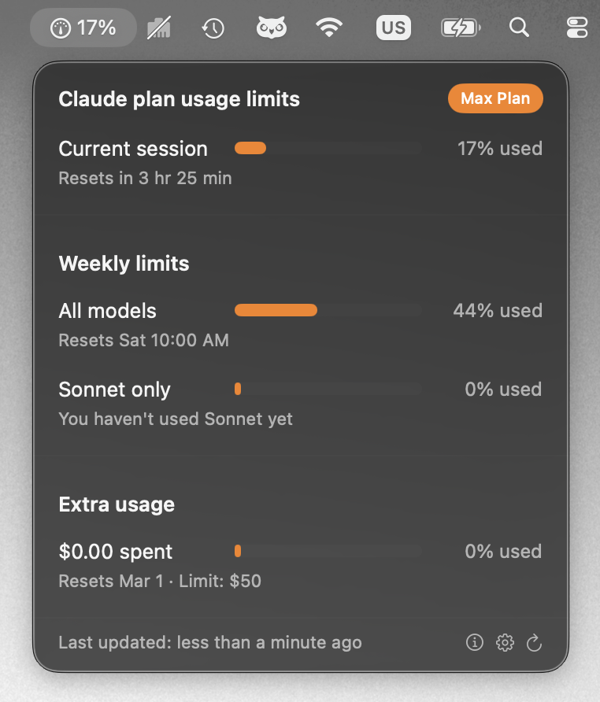
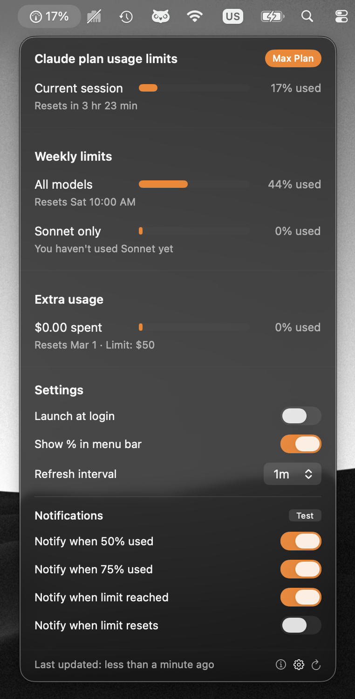
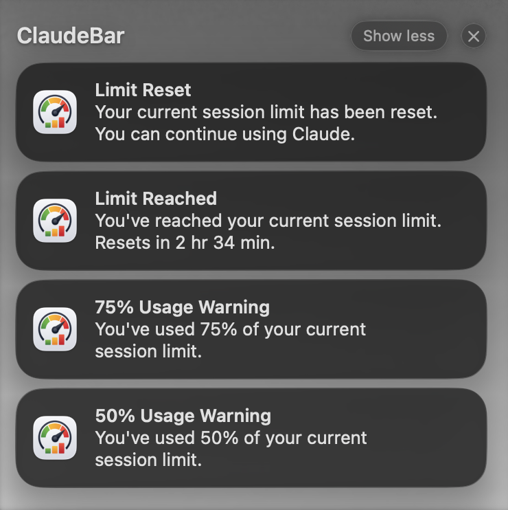
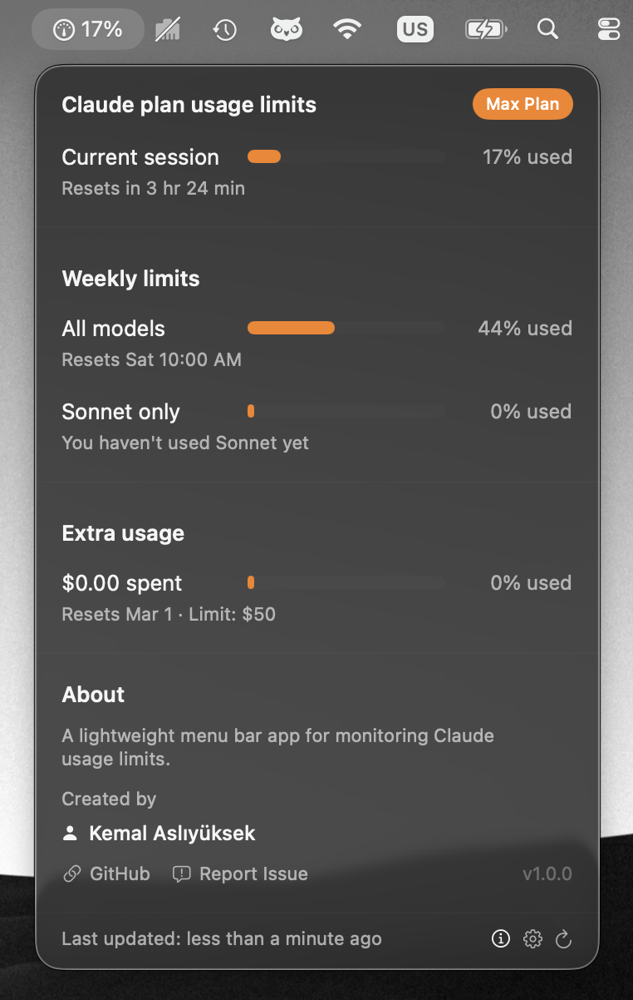

# ClaudeBar

<p align="center">
  
</p>

<p align="center">
  <strong>Um aplicativo nativo de barra de menu do macOS para monitorar os limites de uso do Claude em tempo real.</strong>
</p>

<p align="center">
  
  
  
</p>

<p align="center">
  <a href="../README.md">English</a> •
  <a href="README-TR.md">Türkçe</a> •
  <a href="README-ZH.md">中文</a> •
  <a href="README-HI.md">हिन्दी</a> •
  <a href="README-ES.md">Español</a> •
  <a href="README-FR.md">Français</a> •
  <a href="README-AR.md">العربية</a> •
  <a href="README-PT.md">Português</a> •
  <a href="README-JA.md">日本語</a> •
  <a href="README-RU.md">Русский</a> •
  <a href="README-IT.md">Italiano</a>
</p>

> **Nota:** Esta tradução foi gerada por IA e pode conter erros ou imprecisões. Envie um Pull Request para correções.

---

## Recursos

- **Monitoramento de Uso em Tempo Real** - Veja os limites de sessão atual e semanais de relance
- **Selo do Plano** - Exibe sua assinatura atual (Pro, Max, Team)
- **Suporte a Uso Extra** - Rastreie créditos pay-as-you-go quando habilitado
- **Notificações Personalizáveis** - Receba notificações em 50%, 75%, 100% ou na reinicialização
- **Atualização Automática** - Intervalo de atualização configurável (30s, 1m, 2m, 5m)
- **Iniciar no Login** - Opcionalmente inicie com seu Mac
- **Porcentagem na Barra de Menu** - Mostrar/ocultar porcentagem ao lado do ícone
- **Experiência Nativa** - Construído com SwiftUI, segue as diretrizes de design do macOS
- **Leve** - Uso mínimo de recursos, sem Electron
- **Focado em Privacidade** - Sem analytics, sem telemetria

## Capturas de Tela

<p align="center">
  
</p>

<p align="center">
  <em>Monitoramento de uso em tempo real com selo do plano</em>
</p>

<details>
<summary><strong>Mais Capturas de Tela</strong></summary>

<br>

| Configurações | Notificações | Sobre |
|:-------------:|:------------:|:-----:|
|  |  |  |

</details>

## Requisitos

- macOS 14.0 (Sonoma) ou posterior
- [Claude Code](https://claude.ai/code) instalado e logado
- Assinatura ativa do Claude Pro, Max ou Team

## Instalação

### Baixar Binário Pré-compilado

Baixe o `.app` mais recente na página de [Releases](https://github.com/kemalasliyuksek/claudebar/releases) e arraste para sua pasta Aplicativos.

> **Nota:** Se o macOS mostrar "ClaudeBar está danificado e não pode ser aberto", execute o seguinte comando para remover a flag de quarentena:
> ```bash
> xattr -cr ClaudeBar.app
> ```

### Compilar a partir do Código Fonte

```bash
git clone https://github.com/kemalasliyuksek/claudebar.git
cd claudebar
./build.sh
```

O pacote do aplicativo será criado em `.build/release/ClaudeBar.app`.

Para instalar:
```bash
cp -r .build/release/ClaudeBar.app /Applications/
```

## Uso

1. Certifique-se de estar logado no Claude Code (o comando `claude` deve funcionar no terminal)
2. Inicie o ClaudeBar a partir dos Aplicativos ou Spotlight
3. Clique no ícone do medidor na barra de menu para ver os limites de uso

### Configurações

Clique no ícone ⚙️ para configurar:

| Configuração | Descrição |
|-------------|-----------|
| Iniciar no login | Iniciar automaticamente ao fazer login |
| Mostrar % na barra de menu | Exibir porcentagem ao lado do ícone da barra de menu |
| Intervalo de atualização | Com que frequência buscar dados de uso (30s - 5m) |
| Notificar em 50% | Enviar notificação em 50% de uso |
| Notificar em 75% | Enviar notificação em 75% de uso |
| Notificar ao atingir limite | Enviar notificação quando o limite for atingido |
| Notificar ao reiniciar | Enviar notificação quando o limite reiniciar |

### Sobre

Clique no ícone ⓘ para ver informações do aplicativo, créditos e links.

## Como Funciona

O ClaudeBar lê as credenciais OAuth das Chaves do macOS que o Claude Code armazena ao fazer login. Em seguida, consulta a API da Anthropic para obter seus limites de uso atuais.

### Arquitetura

```
┌─────────────────┐                      ┌───────────────────────────┐
│                 │  Armazena tokens     │                           │
│   Claude Code   │─────────────────────▶│     Chaves do macOS       │
│   (CLI login)   │                      │ "Claude Code-credentials" │
└─────────────────┘                      └───────────────────────────┘
                                                     │
                                                     │ Lê os tokens
                                                     ▼
┌─────────────────┐                      ┌───────────────────────────┐
│                 │ GET /api/oauth/usage │                           │
│  Anthropic API  │◀─────────────────────│        ClaudeBar          │
│                 │─────────────────────▶│                           │
└─────────────────┘    Dados de uso      └───────────────────────────┘
```

## Notas Importantes

### Acesso às Chaves

Na primeira execução, o macOS pode solicitar que você permita o acesso do ClaudeBar às Chaves. Clique em **Permitir Sempre** para operação sem interrupções.

### Privacidade

- Apenas lê credenciais existentes das Chaves
- Toda comunicação usa HTTPS
- Nenhum dado armazenado fora das Chaves do sistema
- Sem analytics ou telemetria
- Totalmente open source

## Contribuir

Contribuições são bem-vindas! Sinta-se à vontade para enviar um Pull Request.

1. Faça fork do repositório
2. Crie sua branch de recurso (`git checkout -b feature/recurso-incrível`)
3. Faça commit das alterações (`git commit -m 'Adicionar recurso incrível'`)
4. Faça push para a branch (`git push origin feature/recurso-incrível`)
5. Abra um Pull Request

## Licença

Este projeto está licenciado sob a Licença MIT - veja o arquivo [LICENSE](../LICENSE) para detalhes.

## Autor

**Kemal Aslıyüksek** - [@kemalasliyuksek](https://github.com/kemalasliyuksek)

## Aviso Legal

Este é um projeto comunitário não oficial e não é afiliado, oficialmente mantido ou endossado pela Anthropic. Use por sua conta e risco.
