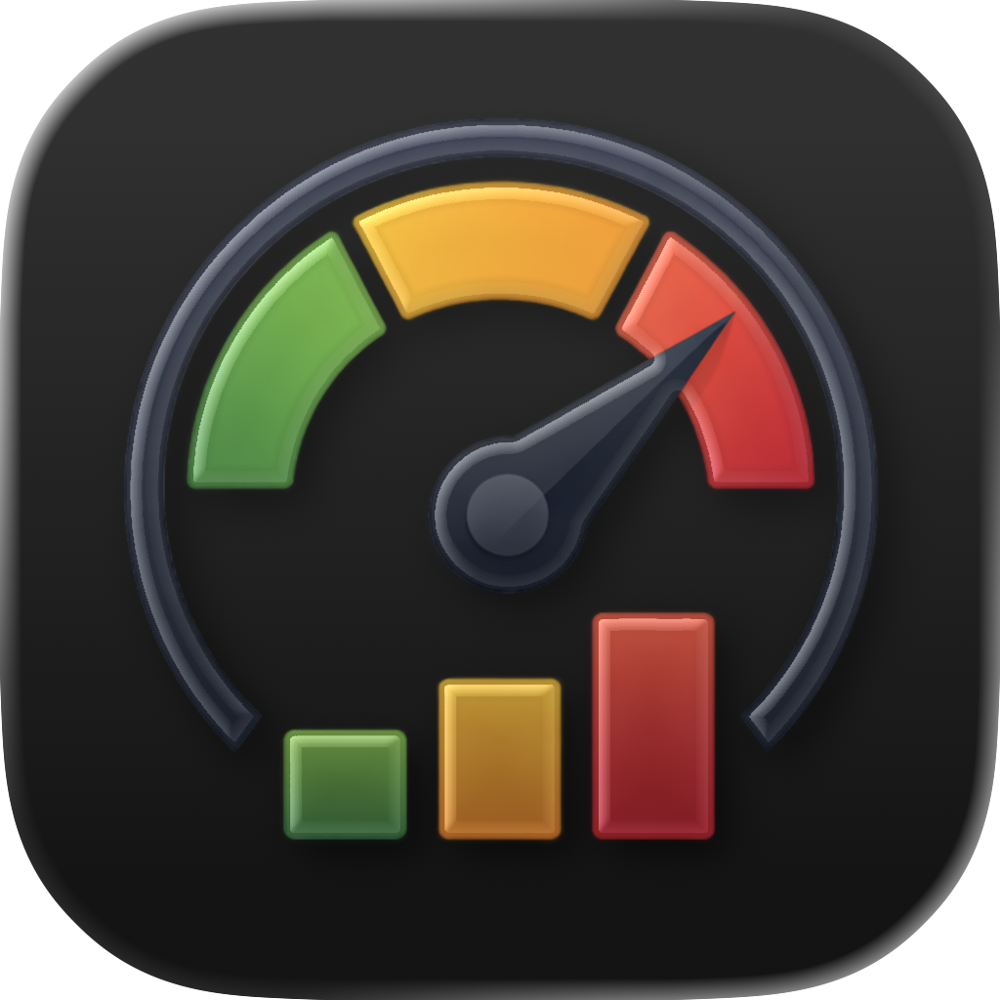
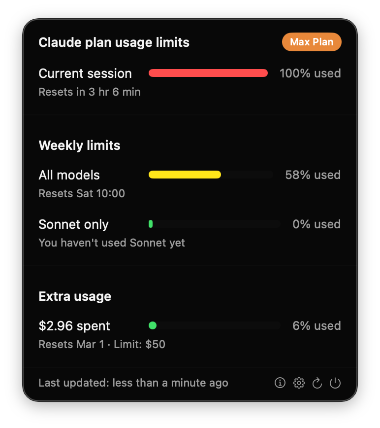
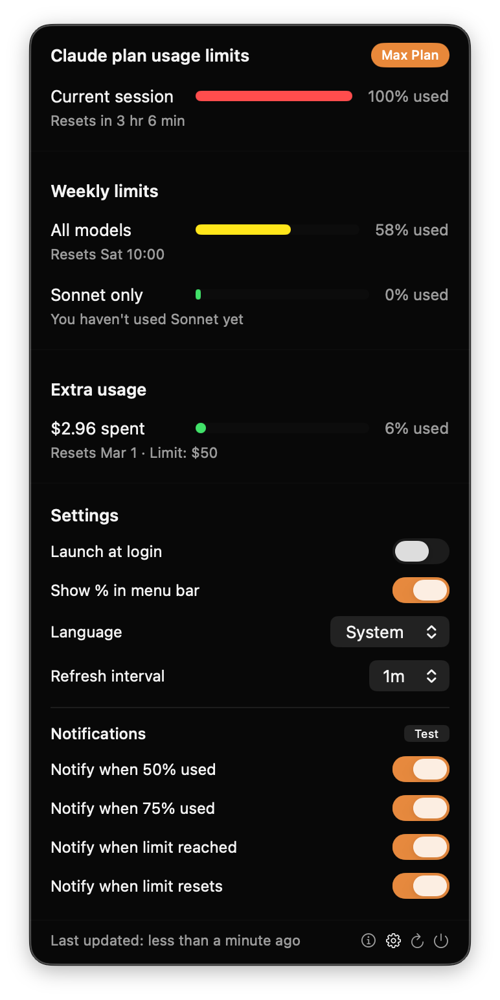
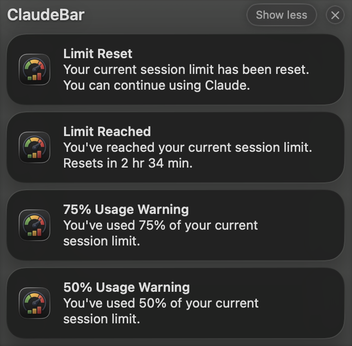
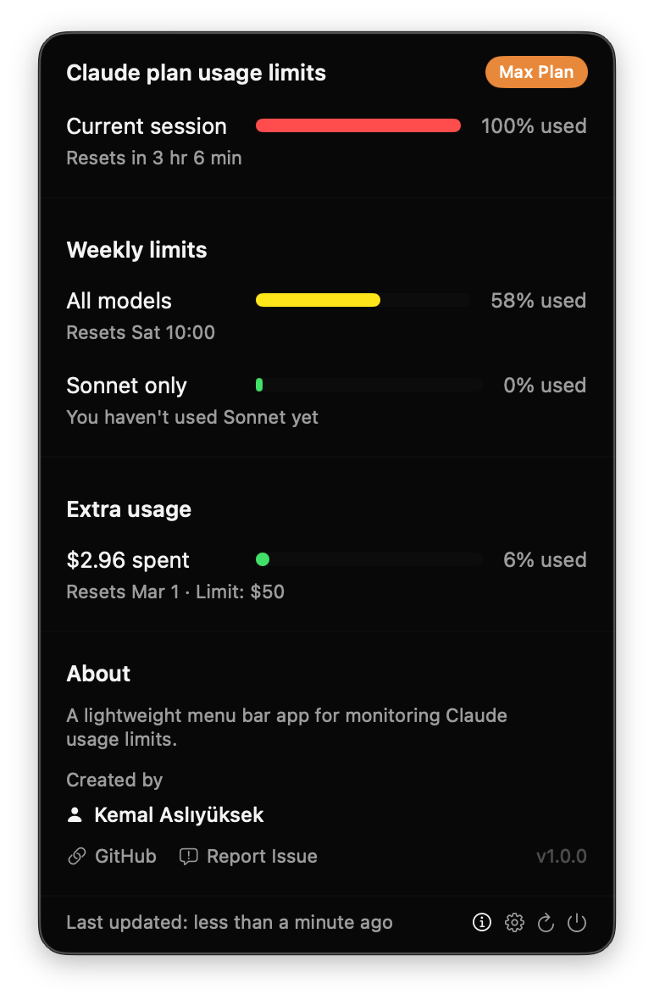

# ClaudeBar

<p align="center">
  
</p>

<p align="center">
  <strong>Claude kullanım limitlerini gerçek zamanlı izlemek için yerel bir macOS menü çubuğu uygulaması.</strong>
</p>

<p align="center">
  
  
  
</p>

<p align="center">
  <a href="../README.md">English</a> •
  <a href="README-TR.md">Türkçe</a> •
  <a href="README-ZH.md">中文</a> •
  <a href="README-HI.md">हिन्दी</a> •
  <a href="README-ES.md">Español</a> •
  <a href="README-FR.md">Français</a> •
  <a href="README-AR.md">العربية</a> •
  <a href="README-PT.md">Português</a> •
  <a href="README-JA.md">日本語</a> •
  <a href="README-RU.md">Русский</a> •
  <a href="README-IT.md">Italiano</a>
</p>

---

## Özellikler

- **Gerçek Zamanlı Kullanım İzleme** - Mevcut oturum ve haftalık kullanım limitlerini bir bakışta görün
- **Plan Rozeti** - Mevcut aboneliğinizi gösterir (Pro, Max 5x, Max 20x, Team, Enterprise)
- **Model Bazlı Haftalık Limitler** - Planınız bildirdiğinde Fable, Opus ve Sonnet için ayrı satırlar
- **Kullanım Kredileri** - Tek seferlik kredileri ve son kullanma tarihlerini gösterir
- **Ekstra Kullanım Desteği** - Kullandıkça öde harcamasını takip edin, kuruluşunuz kapattıysa nedenini görün
- **Renk Kodlu İlerleme Çubukları** - Kullanım yüzdesine göre yeşil, sarı, turuncu, kırmızı
- **Çoklu Dil Desteği** - İngilizce, Türkçe, Çince, İspanyolca, Rusça ve uygulama içi dil seçimi
- **Özelleştirilebilir Bildirimler** - İzlenen her limit için %50, %75, %100 veya sıfırlandığında yerel Bildirim Merkezi uyarıları
- **Otomatik Yenileme** - Yapılandırılabilir yenileme aralığı (30sn, 1dk, 2dk, 5dk)
- **Giriş Sırasında Başlat** - İsteğe bağlı olarak Mac'inizle birlikte başlatın
- **Menü Çubuğunda Yüzde** - Menü çubuğu simgesinin yanında yüzdeyi gösterin/gizleyin
- **Yerel Deneyim** - SwiftUI ile oluşturulmuş, macOS tasarım ilkelerini takip eder
- **Hafif** - Minimum kaynak kullanımı, Electron yok
- **Gizlilik Odaklı** - Analitik yok, telemetri yok

## Ekran Görüntüleri

<p align="center">
  
</p>

<p align="center">
  <em>Plan rozeti ile gerçek zamanlı kullanım izleme</em>
</p>

<details>
<summary><strong>Daha Fazla Ekran Görüntüsü</strong></summary>

<br>

| Ayarlar | Bildirimler | Hakkında |
|:-------:|:-----------:|:--------:|
|  |  |  |

</details>

## Gereksinimler

- macOS 14.0 (Sonoma) veya üstü
- [Claude Code](https://claude.ai/code) kurulu ve giriş yapılmış olmalı
- Aktif bir Claude Pro, Max veya Team aboneliği

## Kurulum

### Homebrew (Önerilen)

```bash
brew install --cask kemalasliyuksek/claudebar/claudebar-monitor
```

Bu yöntem macOS Gatekeeper güvenlik kontrolünü otomatik olarak halleder — ek bir adım gerekmez.

### Önceden Derlenmiş Dosyayı İndirin

En son `.app` dosyasını [Releases](https://github.com/kemalasliyuksek/claudebar/releases) sayfasından indirin ve Uygulamalar klasörünüze sürükleyin.

> **Not:** macOS "ClaudeBar hasarlı ve açılamıyor" hatası gösterirse, karantina bayrağını kaldırmak için şu komutu çalıştırın:
> ```bash
> xattr -cr ClaudeBar.app
> ```

### Kaynaktan Derleyin

```bash
git clone https://github.com/kemalasliyuksek/claudebar.git
cd claudebar
./build.sh
```

Uygulama paketi `.build/release/ClaudeBar.app` konumunda oluşturulacaktır.

Kurmak için:
```bash
cp -r .build/release/ClaudeBar.app /Applications/
```

## Kullanım

1. Claude Code'a giriş yaptığınızdan emin olun (terminalde `claude` komutu çalışmalı)
2. ClaudeBar'ı Uygulamalar veya Spotlight'tan başlatın
3. Kullanım limitlerini görmek için menü çubuğundaki gösterge simgesine tıklayın

### Ayarlar

Yapılandırmak için ⚙️ simgesine tıklayın:

| Ayar | Açıklama |
|------|----------|
| Girişte başlat | Oturum açtığınızda otomatik olarak başla |
| Menü çubuğunda % göster | Menü çubuğu simgesinin yanında yüzdeyi göster |
| Dil | Uygulama dilini seçin (Sistem, English, Türkçe, 中文, Español, Русский) |
| Yenileme aralığı | Kullanım verilerinin ne sıklıkla çekileceği (30sn - 5dk) |
| %50'de bildir | %50 kullanımda bildirim gönder |
| %75'te bildir | %75 kullanımda bildirim gönder |
| Limite ulaşıldığında bildir | Limite ulaşıldığında bildirim gönder |
| Sıfırlandığında bildir | Limit sıfırlandığında bildirim gönder |

### Hakkında

Uygulama bilgileri, kreditler ve bağlantılar için ⓘ simgesine tıklayın.

## Nasıl Çalışır

ClaudeBar, Claude Code'un giriş yaptığınızda sakladığı OAuth kimlik bilgilerini macOS Keychain'den okur. Ardından Claude Code'un `/usage` komutunun kullandığı uç noktayı sorgular.

Token'ın süresi dolmak üzereyse ClaudeBar onu Claude Code ile aynı protokolle yeniler: önce Claude Code'un yenileme kilidini (`~/.claude.lock`) alır, Keychain'i yeniden okur ve Claude Code bu arada yenilemişse yeni token'ı kullanır; aksi halde kendisi yeniler ve sonucu yerinde günceller. Yazma `security` aracına stdin üzerinden verilir, token süreç argümanlarında görünmez. Keychain kullanılamıyorsa `~/.claude/.credentials.json` dosyasına düşülür.

### Mimari

```
┌─────────────────┐                      ┌───────────────────────────┐
│                 │  Tokenları saklar    │                           │
│   Claude Code   │─────────────────────▶│     macOS Keychain        │
│   (CLI giriş)   │                      │ "Claude Code-credentials" │
└─────────────────┘                      └───────────────────────────┘
                                                     │
                                                     │ Tokenları okur
                                                     ▼
┌─────────────────┐                      ┌───────────────────────────┐
│                 │ GET /api/oauth/usage │                           │
│  Anthropic API  │◀─────────────────────│        ClaudeBar          │
│                 │─────────────────────▶│                           │
└─────────────────┘   Kullanım verisi    └───────────────────────────┘
```

## Önemli Notlar

### Anahtarlık Erişimi

Okuma ve yazma Claude Code ile aynı yoldan, sistemin `security` aracıyla yapılır; bu yüzden genellikle ek bir Anahtarlık sorusu çıkmaz. macOS yine de sorarsa **Her Zaman İzin Ver**'e tıklayın.

### Bildirimler

İlk açılışta macOS, ClaudeBar'ın bildirim gösterip gösteremeyeceğini sorar. Reddederseniz daha sonra Sistem Ayarları › Bildirimler › ClaudeBar altından açabilirsiniz.

### Gizlilik

- Yalnızca Claude Code'un sakladığı kimlik bilgilerini okur, geriye yalnızca yenilenmiş token'ı yazar
- Tüm iletişim HTTPS kullanır
- Sistem Keychain'i dışında veri depolanmaz
- Analitik veya telemetri yok
- Tamamen açık kaynak

## Katkı

Katkılarınız memnuniyetle karşılanır! Pull Request göndermekten çekinmeyin.

1. Repoyu fork'layın
2. Feature branch'inizi oluşturun (`git checkout -b feature/harika-ozellik`)
3. Değişikliklerinizi commit'leyin (`git commit -m 'Harika özellik ekle'`)
4. Branch'e push yapın (`git push origin feature/harika-ozellik`)
5. Pull Request açın

## Lisans

Bu proje MIT Lisansı altında lisanslanmıştır - detaylar için [LICENSE](../LICENSE) dosyasına bakın.

## Yazar

**Kemal Aslıyüksek** - [@kemalasliyuksek](https://github.com/kemalasliyuksek)

## Sorumluluk Reddi

Bu resmi olmayan bir topluluk projesidir ve Anthropic ile bağlantılı değildir, Anthropic tarafından resmi olarak bakılmaz veya desteklenmez. Kendi takdirinize bağlı olarak kullanın.
