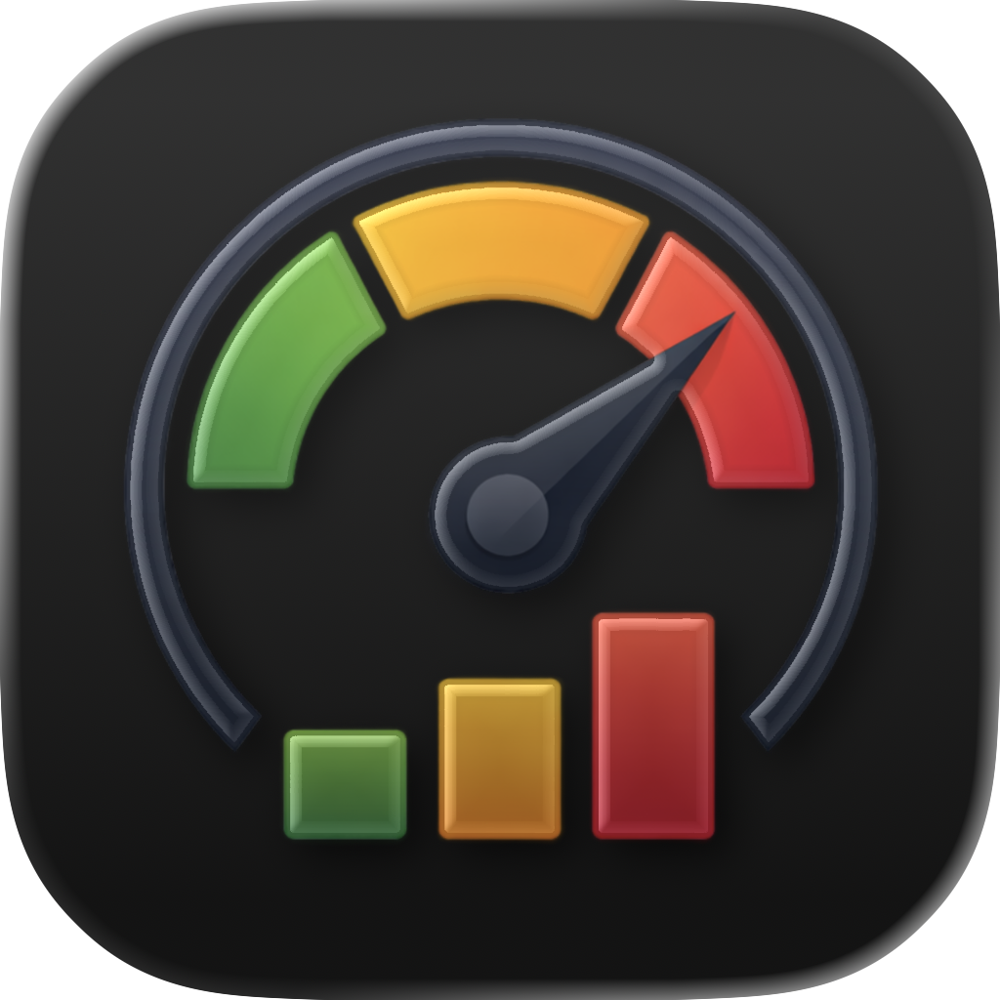
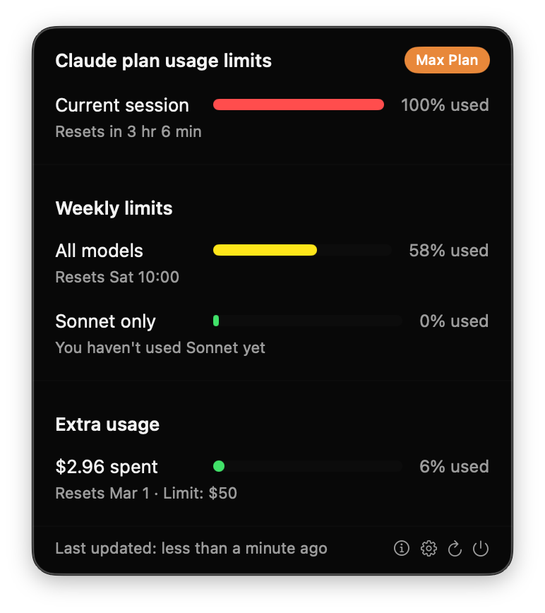
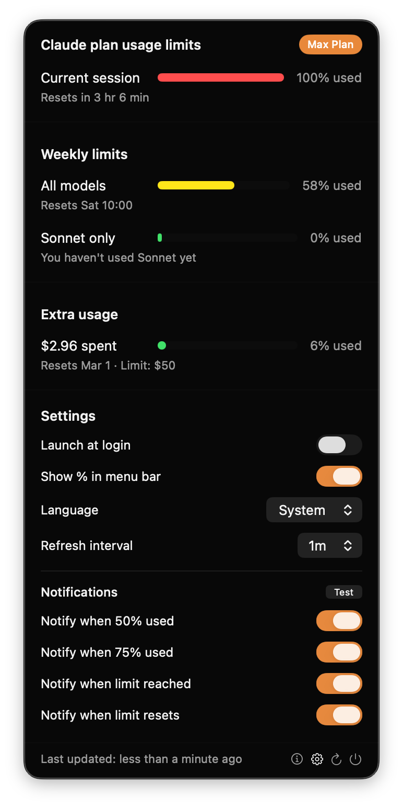
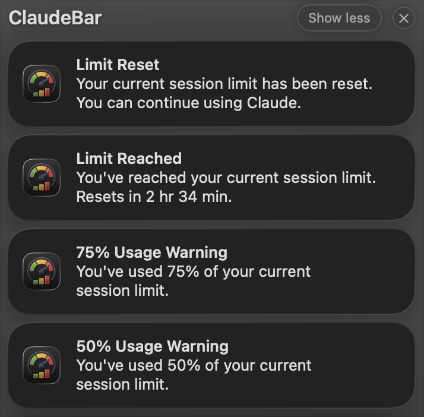
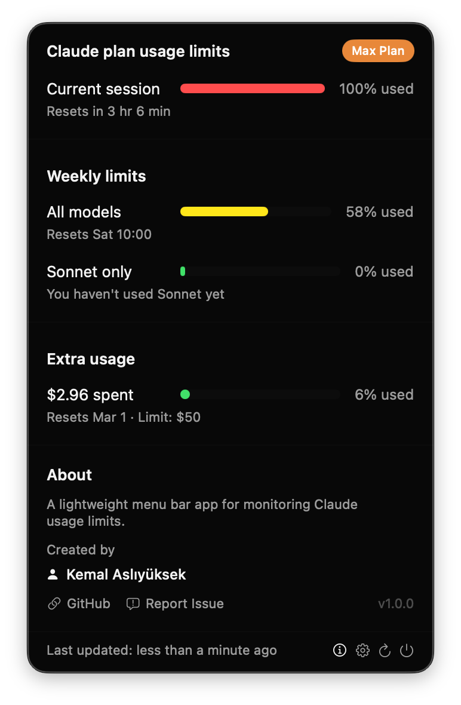

# ClaudeBar

<p align="center">
  
</p>

<p align="center">
  <strong>一款原生 macOS 菜单栏应用，用于实时监控 Claude 使用限额。</strong>
</p>

<p align="center">
  
  
  
</p>

<p align="center">
  <a href="../README.md">English</a> •
  <a href="README-TR.md">Türkçe</a> •
  <a href="README-ZH.md">中文</a> •
  <a href="README-HI.md">हिन्दी</a> •
  <a href="README-ES.md">Español</a> •
  <a href="README-FR.md">Français</a> •
  <a href="README-AR.md">العربية</a> •
  <a href="README-PT.md">Português</a> •
  <a href="README-JA.md">日本語</a> •
  <a href="README-RU.md">Русский</a> •
  <a href="README-IT.md">Italiano</a>
</p>

> **注意：** 本翻译由人工智能生成，可能包含错误或不准确之处。欢迎通过 Pull Request 提交修正。

---

## 功能特性

- **实时使用监控** - 一目了然地查看当前会话和每周使用限额
- **订阅计划徽章** - 显示您当前的订阅类型（Pro、Max、Team）
- **额外用量支持** - 启用后追踪按需付费额度
- **彩色进度条** - 根据使用百分比显示绿色、黄色、橙色、红色
- **多语言支持** - 英语、土耳其语、中文、西班牙语、俄语，支持应用内语言切换
- **可自定义通知** - 在 50%、75%、100% 或重置时收到通知
- **自动刷新** - 可配置的刷新间隔（30秒、1分钟、2分钟、5分钟）
- **登录时启动** - 可选择随 Mac 一起启动
- **菜单栏百分比** - 在菜单栏图标旁显示/隐藏使用百分比
- **原生体验** - 使用 SwiftUI 构建，遵循 macOS 设计规范
- **轻量级** - 资源占用极少，无需 Electron
- **注重隐私** - 无数据分析，无遥测

## 截图

<p align="center">
  
</p>

<p align="center">
  <em>带有订阅计划徽章的实时使用监控</em>
</p>

<details>
<summary><strong>更多截图</strong></summary>

<br>

| 设置 | 通知 | 关于 |
|:----:|:----:|:----:|
|  |  |  |

</details>

## 系统要求

- macOS 14.0 (Sonoma) 或更高版本
- 已安装并登录 [Claude Code](https://claude.ai/code)
- 有效的 Claude Pro、Max 或 Team 订阅

## 安装

### Homebrew（推荐）

```bash
brew install --cask kemalasliyuksek/claudebar/claudebar-monitor
```

此方式自动处理 macOS Gatekeeper 安全检查，无需额外操作。

### 下载预编译版本

从 [Releases](https://github.com/kemalasliyuksek/claudebar/releases) 页面下载最新的 `.app` 文件，然后将其拖入"应用程序"文件夹。

> **注意：** 如果 macOS 提示"ClaudeBar 已损坏，无法打开"，请运行以下命令移除隔离标志：
> ```bash
> xattr -cr ClaudeBar.app
> ```

### 从源代码编译

```bash
git clone https://github.com/kemalasliyuksek/claudebar.git
cd claudebar
./build.sh
```

应用程序包将创建在 `.build/release/ClaudeBar.app`。

安装：
```bash
cp -r .build/release/ClaudeBar.app /Applications/
```

## 使用方法

1. 确保已登录 Claude Code（终端中 `claude` 命令应可正常使用）
2. 从"应用程序"或 Spotlight 启动 ClaudeBar
3. 点击菜单栏中的仪表图标查看使用限额

### 设置

点击 ⚙️ 图标进行配置：

| 设置 | 说明 |
|------|------|
| 登录时启动 | 登录时自动启动 |
| 菜单栏显示百分比 | 在菜单栏图标旁显示百分比 |
| 语言 | 选择应用语言（系统、English、Türkçe、中文、Español、Русский） |
| 刷新间隔 | 获取使用数据的频率（30秒 - 5分钟） |
| 50% 时通知 | 使用达到 50% 时发送通知 |
| 75% 时通知 | 使用达到 75% 时发送通知 |
| 达到限额时通知 | 达到使用限额时发送通知 |
| 限额重置时通知 | 限额重置时发送通知 |

### 关于

点击 ⓘ 图标查看应用信息、致谢和链接。

## 工作原理

ClaudeBar 从 macOS 钥匙串中读取 Claude Code 登录时存储的 OAuth 凭据，然后查询 Anthropic API 获取当前使用限额。

### 架构

```
┌─────────────────┐                      ┌───────────────────────────┐
│                 │  Stores tokens       │                           │
│   Claude Code   │─────────────────────▶│     macOS Keychain        │
│   (CLI login)   │                      │ "Claude Code-credentials" │
└─────────────────┘                      └───────────────────────────┘
                                                     │
                                                     │ Reads tokens
                                                     ▼
┌─────────────────┐                      ┌───────────────────────────┐
│                 │ GET /api/oauth/usage │                           │
│  Anthropic API  │◀─────────────────────│        ClaudeBar          │
│                 │─────────────────────▶│                           │
└─────────────────┘    Usage data        └───────────────────────────┘
```

## 重要说明

### 钥匙串访问

首次启动时，macOS 可能会提示您允许 ClaudeBar 访问钥匙串。请点击 **始终允许** 以确保正常运行。

### 隐私

- 仅读取钥匙串中现有的凭据
- 所有通信使用 HTTPS
- 不在系统钥匙串之外存储任何数据
- 无数据分析或遥测
- 完全开源

## 贡献

欢迎贡献！请随时提交 Pull Request。

1. Fork 本仓库
2. 创建功能分支 (`git checkout -b feature/amazing-feature`)
3. 提交更改 (`git commit -m 'Add amazing feature'`)
4. 推送到分支 (`git push origin feature/amazing-feature`)
5. 创建 Pull Request

## 许可证

本项目基于 MIT 许可证授权 - 详情请参阅 [LICENSE](../LICENSE) 文件。

## 作者

**Kemal Aslıyüksek** - [@kemalasliyuksek](https://github.com/kemalasliyuksek)

## 免责声明

这是一个非官方的社区项目，与 Anthropic 无关，未经 Anthropic 官方维护或认可。使用风险自负。
